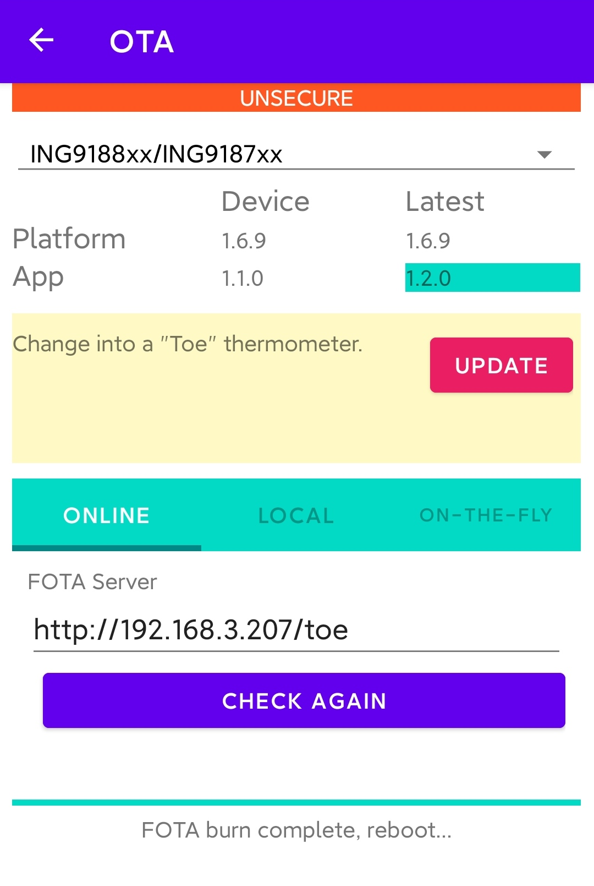

# INGChips FOTA for Android

This is another implementation of INGChips FOTA Client for Android in Java and Kotlin.

## Other implementations:

1. C#: [INGDemo](https://github.com/ingchips/INGdemo/tree/master/INGdemo/INGdemo/FOTA)
1. Zig/C: [Central FOTA](https://github.com/ingchips/ING918XX_SDK_SOURCE/tree/master/examples-gcc/central_fota) in SDK
1. JavaScript:
    * [Web FOTA](https://ingchips.github.io/web_apps/ing918_ota/index.html)
    * Mini Program
1. etc.

